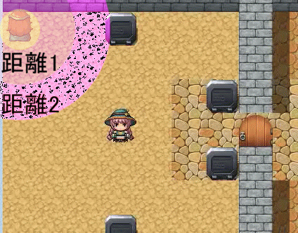
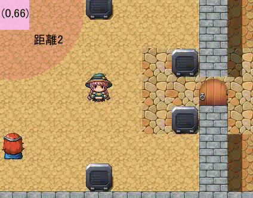
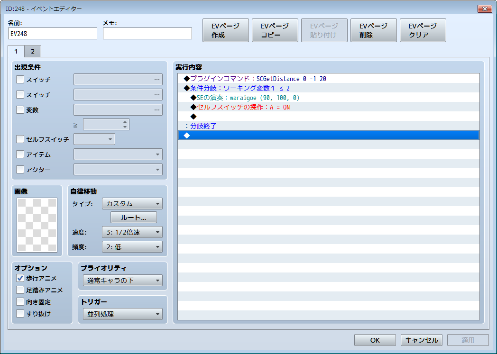
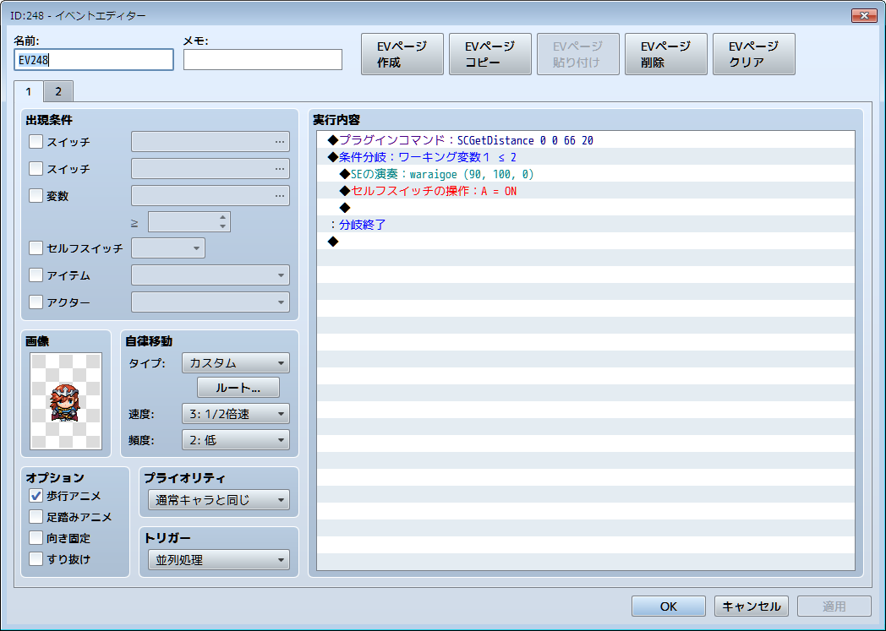
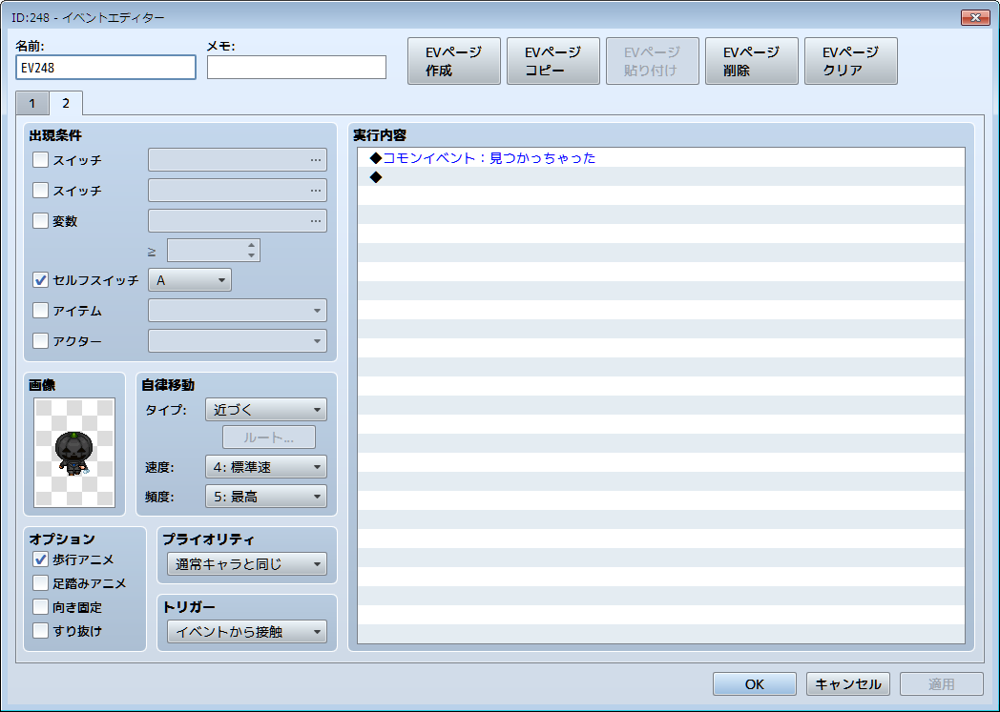

# SCGetDistance
RPG Maker MV Plugins (personal work)

# これは何？
イベントとイベントまたは座標との距離を計算するプラグインです。
イベントが近づいたり離れたりしたときに動作を切り替えたいときなどにお使い下さい。

- ２つのイベントの距離を測るサンプル


- イベントと座標との距離を測るサンプル


# インストール方法
1. RPG Maker MV のメニュー[Game]→[Open Folder] を選択します。
1. 開いた場所から js/plugins フォルダへ移動します。
1. SCGetDistance.js を js/plugins フォルダに保存してください。  

# プラグインの選択
1. RPG Maker MV のメニュー [Tools] → [Plugin Manager] を選択します。
1. Plugin Manager ウィンドウで新しいプラグインを設定する plugin ウィンドウを開きます。
1. Name ドロップダウンリストから SCGetDistance を選択します。

# プラグインの呼び出し
プラグインは引数３つの場合と４つの場合があります。

```SCGetDistance E1 E2 V1```

2 つのイベントの距離を計算します。

|引数|説明|
|---|----|
|E1|1つ目のイベントの番号です。|
|E2|2つ目のイベントの番号です。|
|V1|計算した距離を格納する変数の番号です。|

```SCGetDistance E1 X1 Y1 V1```

イベントと指定した座標との距離を計算します。

|引数|説明|
|---|----|
|E1|イベントの番号です。|
|X1|座標の X 軸の値です。|
|Y1|座標の Y 軸の値です。|
|V1|計算した距離を格納する変数の番号です。|

イベントの番号は、イベントに割り振られた番号のほかに、
0 で呼び出したイベント、-1 でプレイヤーのイベントを表せます。

# 用例
最初に掲載したサンプルの gif 画像のイベントを紹介します。

## 引数3つの場合の用例

このイベントとプレイヤーのイベントの距離を計算して、変数20番に格納します。  
後は、条件分岐で変数20番(名称：ワーキング変数1)を比較します。  
この例では、距離が 2 よりも近ければセルフスイッチAをONにして２ページ目に移ります。

## 引数4つの場合の用例

このイベントと座標 (0, 66) の距離を計算して、変数20番に格納します。  
後は、条件分岐で変数20番(名称：ワーキング変数1)を比較します。  
この例では、距離が 2 よりも近ければセルフスイッチAをONにして２ページ目に移ります。

余談ですが、２ページ目は次のように設定しました。


# 謝辞
今回のサンプル画像で[ぴぽや](http://piposozai.blog76.fc2.com/)様の画像を使わせていただきました。
