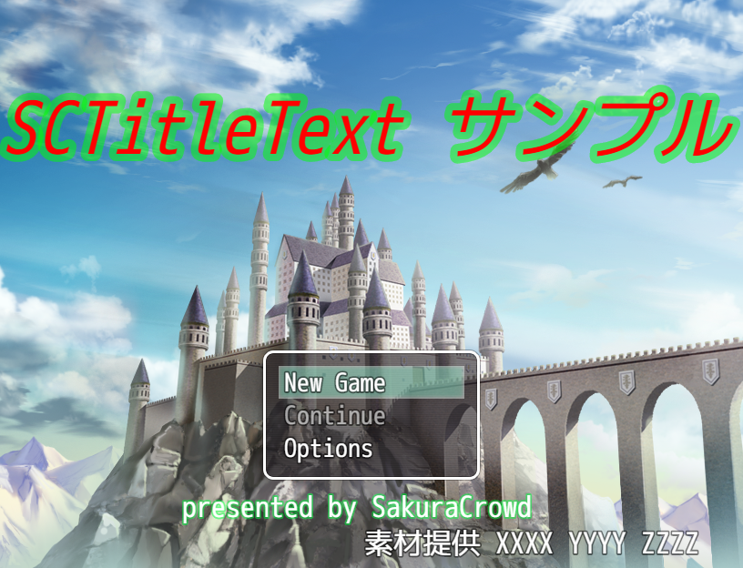
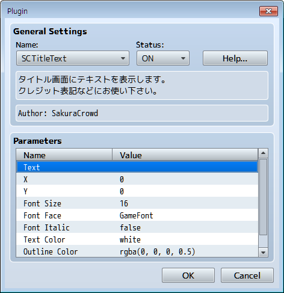

# SCTitleText
RPG Maker MV Plugins (personal work)

# これは何？
タイトルシーンにテキストを表示させるプラグインです。  
クレジット表記などにお使いください。  
位置、サイズ、フォント、斜体、色(半透明も可能)、アウトラインを指定できます。    



サンプル画像では、次の３つのテキストを表示しています。
* SCTitleText サンプル
* presented by SakuraCrowd
* 素材提供 xxxx yyyy zzzz

複数のテキストを表示する方法は後述します。

# インストール方法
1. RPG Maker MV のメニュー[Game]→[Open Folder] を選択します。
1. 開いた場所から js/plugins フォルダへ移動します。
1. SCTitleText.js を js/plugins フォルダに保存してください。  

# 使い方
1. RPG Maker MV のメニュー [Tools] → [Plugin Manager] を選択します。
1. Plugin Manager ウィンドウで新しいプラグインを設定する plugin ウィンドウを開きます。
1. Name ドロップダウンリストから SCTitleText を選択します。
1. パラメータの設定を行います。
	

    * Text  
    表示するテキストの文字列です。  
    既定値は空の文字列です。  

	* X  
	テキストを配置する左端の X 座標です。  
	既定値は 0 です。  

	* Y  
	テキストを配置する上端の Y 座標です。  
	既定値は 0 です。  

	* Font Size  
	テキストのフォントサイズです。  
	既定値は 16 です。  

	* Font Face  
	テキストのフォント名です。  
	既定値は GameFont です。  

	* Font Italic  
	true ならばテキストを斜体にします。  
	既定値は false です。  

	* Text Color  
	テキストの色です。 rgba でも指定できます。 
	既定値はt white です。  

	* Outline Color  
	テキストの外郭の色です。  
	既定値は rgba(0, 0, 0, 0.5) です。  

	* Outline Width  
	@desc テキストの外郭の幅です。  
	既定値は 4 です。  

# 色を rgba で指定する方法
rgba(R,G,B,A) は、R, G, B の整数値を 0 ~ 255 、 A の小数値を 0.0 ~ 1.0 の範囲で指定します。  
半透明の緑色を指定する場合は ```rgba(0, 255, 0, 0.5)``` と指定します。

# タイトルシーンで複数のテキストを表示する方法
このプラグインファイルを別の名前でコピーして、それを使用してください。  

このとき、ソースコードの  
``` var filename = 'SCTitleText' ```  
の右辺を同じファイル名に変更してください。

たとえば、 SCTitleText.js をコピーして同じフォルダ内に  
 SCTitleText2.js を作成した場合は  
```var filename = 'SCTitleText2'```  
に書き換えてください。  

そして、プラグインマネージャで SCTitleText2 を選択して利用してください。  

# ライセンスについて
このプラグインのライセンスは NYSL Version 0.9982 です。  
各自の責任においてご利用下さい。  
詳しくは同じフォルダの license.txt をご覧下さい。

